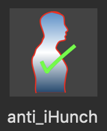
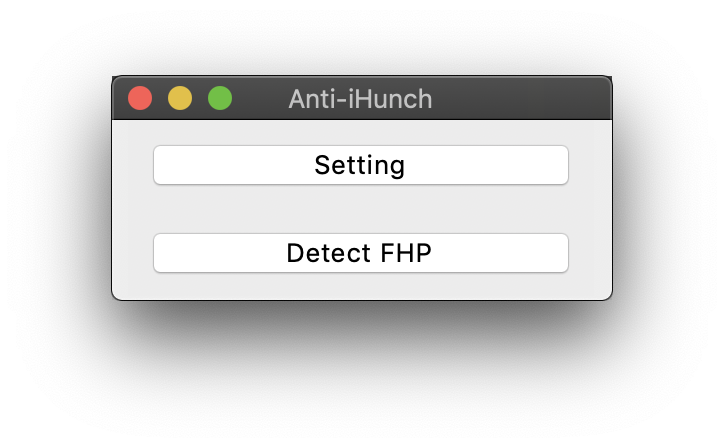

# Anti iHunch

## [Slides for COSCUP](https://kuiming.github.io/anti_iHunch/presentation/output/index.html#/)

## [Slides for Microsoft MVP](https://kuiming.github.io/anti_iHunch/presentation/output_MVP/index.html#/)

## What is iHunch

iHunch means Forward Head Posture (FHP). In Chinese, iHunch is "頸前傾".
Forward Head Posture is the cause of discomfort in the upper back and the neck. Normally, the center of our head should be directly above the neck, and the center of the top of the head should be in a straight line with the first cervical vertebra (C1) and the midline of the body. But for the people with FHP, the center of the head is obliquely in front of the neck, that is, in front of this straight line.

## Purpose of Anti iHunch

Confirm the relative position of the head through face detection, and detect whether the users are hunched. If the users are hunched, Anti iHunch will remind the users to keep their heads up.

## Dependencies

```
git clone https://github.com/davisking/dlib
pip3.7 install build
python3.7 -m build --wheel
pip3.7 install dist/dlib-<version>.whl
```

## Installation

```
git clone https://github.com/KuiMing/anti_iHunch.git
cd anti_iHunch
python3.7 setup.py install
```

## Use Anti iHunch with python script

### Setting: 
```
python3.7 main.py --setting
```
  - Select Camera.
  - Please keep your head up, and let the red rectangle be around your face.
  - Adjust the camera until the rectangle is at the bottom of the frame.
  - Set maximum time period of FPH.
  - The system will calculate the mean detected face area.
  - The system will save the configure file.
### Detect FHP
```
python3.7 main.py --show
```
### Detect FHP without live video
```
python3.7 main.py
```

## Mac Application

Use Anti iHunch without python script
- [Mac Application URL](https://drive.google.com/file/d/1Yf_ujJDWH1jWn7MTkzFi3TJ2x7BQn8KA/view?usp=sharing)
- Unzip `Anti_iHunch.zip`.
- Double click `Anti_iHunch`.


- Click `Setting` to create `config.json` for your own.
- Click `Detect FHP`.



