# `Anti iHunch`
## 抬頭挺胸！

### 陳奎銘 `Kui-Ming Chen`


---

<!-- .slide: data-background="media/Ben_MVP.png" -->

---

## 相信大部分的上班族，都有久坐的問題

----

## 為了專心看螢幕

----

## 漸漸脖子就會變成這樣.....

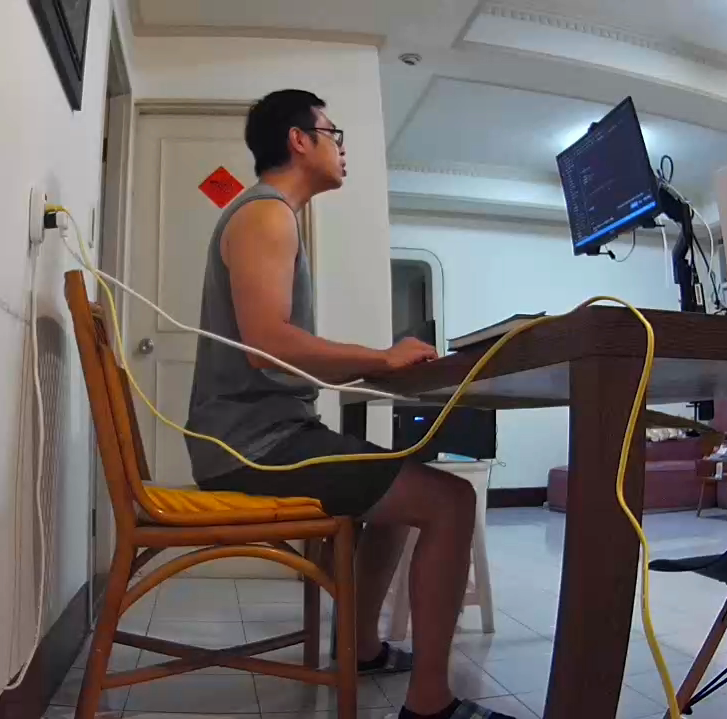

----


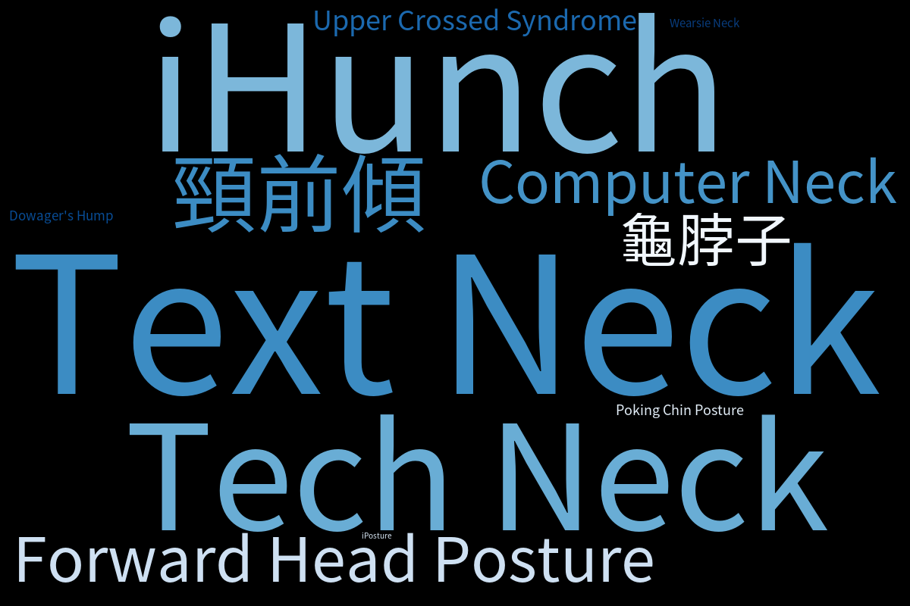


----

## 上交叉症候群

- 頸部屈肌和下背部肌肉無力
- 胸部肌肉和上背部肌肉緊繃
- 駝背
- 頭痛、肩頸痠痛


---

## 我的暑假作業
## 自由研究


---

## 簡單定義 `iHunch`

- 一般的情況，頭部的中心應該會落於頸部的正上方，若頭部的中心落於頸部的前方，就有頸前傾的疑慮。
- 確認有沒有頸前傾的方法
  - Craniovertebral angle measurement
  - Ruler measurement
  

----

### `Craniovertebral Angle Measurement`

- 耳屏與第七節頸椎棘突連線與水平線的夾角
- 耳朵與脖子後方根部凸起點連線與水平線的夾角
- 小於 50 度，就可判斷為頸前傾 

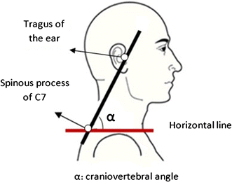


<font size=2 color="#33C7FF" style="position: absolute; top: 665px; left: 50px">fard, B. & Ahmadi, Amir & Maroufi, N. & Sarrafzadeh, Javad. (2016). Evaluation of forward head posture in sitting and standing positions. European Spine Journal. 25. 10.1007/s00586-015-4254-x. </font>

----

### `Craniovertebral Angle Measurement`


----

### `Ruler Measurement`

- 背靠牆，自然站立，量測後腦勺與牆的距離
- 若頭部可以碰到牆，就沒有頸前傾的問題
- 若頭部與牆之間有距離，可能有頸前傾的問題
  - 輕度：< 5 公分
  - 中度：5 到 8 公分
  - 重度：超過 8 公分

<font size=2 color="#33C7FF" style="position: absolute; top: 635px; left: 50px">Widjanantie, Siti & Triangto, Kevin. (2019). Forward Head Posture Examination and its Association with Lung Expiratory Function in Chronic Obstructive Pulmonary Disease (COPD) Patient: A Case Series. 231-237. 10.5220/0009088602310237. </font>

----

### Ruler measurement


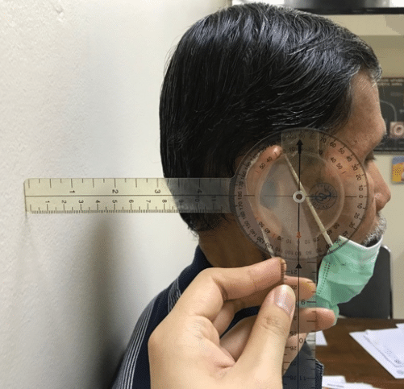


<font size=2 color="#33C7FF" style="position: absolute; top: 635px; left: 50px">Widjanantie, Siti & Triangto, Kevin. (2019). Forward Head Posture Examination and its Association with Lung Expiratory Function in Chronic Obstructive Pulmonary Disease (COPD) Patient: A Case Series. 231-237. 10.5220/0009088602310237. </font>

---

## 觀察自己的情況

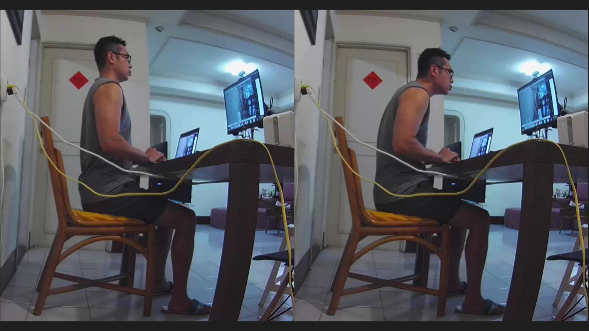


----

## 似乎可以用
## `Image Classification` 


----

### 可以更偷懶嗎？我懶得標注照片～


----

## 觀察頭部的位置

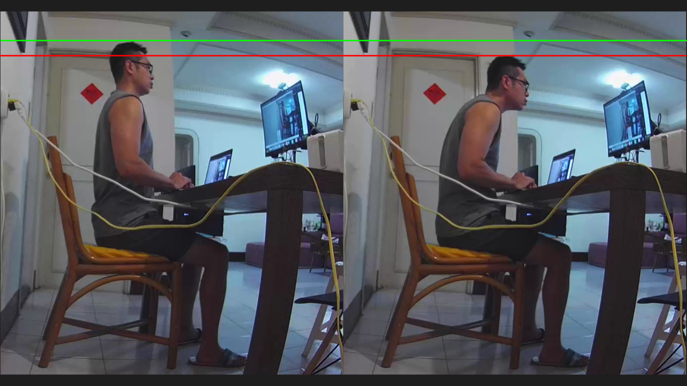

---

## 可能的解決方案（奇技淫巧）
- 偵測頭部位置
  - 超音波感測器
  - 紅外線避障感測器
- Image Classification
  - 攝影機從側面偵測駝背

----

## 想像中的配置

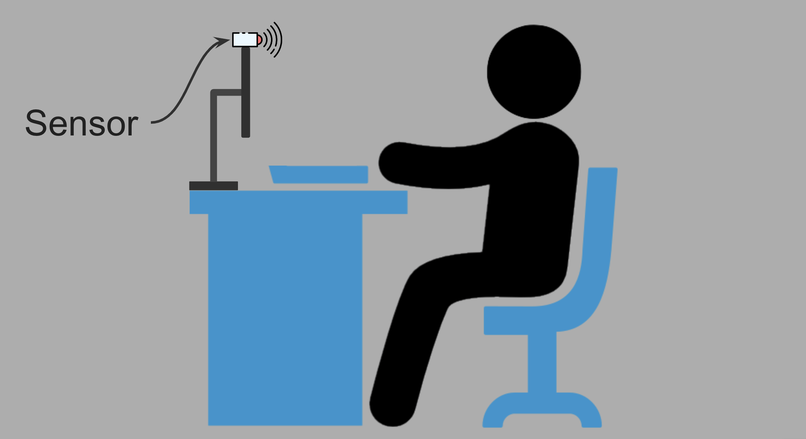

<font size=2 color="#33C7FF" style="position: absolute; top: 635px; left: 50px">From: https://www.flaticon.com/</font>

----

## 超音波感測器的問題

<iframe data-src=https://www.youtube.com/embed/isY5Uw4wzh0 width="100%" height="600px"></iframe>

----

## 紅外線避障感測器的問題

<iframe data-src=https://www.youtube.com/embed/7uH-YMAJoFY width="100%" height="600px"></iframe>

----


## 囧～～我依然不想做 
## `Image Classification`

----


## 那改做 `Face Detection` 好了

---

## `Anti iHunch`

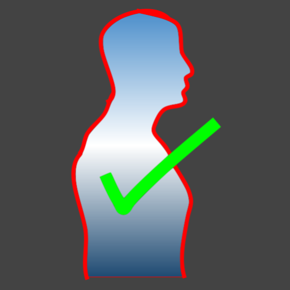


----

## `Anti iHunch` 偵測概念

- 只要駝背或頸前傾，頭部高度就會下降 <!-- .element: class="fragment" data-fragment-index="1" -->
- 從正面觀察頭部的位置 <!-- .element: class="fragment" data-fragment-index="2" -->
- 當頭部下降，人臉可能就超出攝影機的照野 <!-- .element: class="fragment" data-fragment-index="3" -->
- 當身體往後躺的時候，人臉面積也會變小 <!-- .element: class="fragment" data-fragment-index="4" -->
- 做 Face Detection，可以直接套用現成的 Python 套件 <!-- .element: class="fragment" data-fragment-index="5" -->
  - `Face_Recognition` <!-- .element: class="fragment" data-fragment-index="5" -->
  - `OpenCV` <!-- .element: class="fragment" data-fragment-index="5" -->

----

## `Anti iHunch` 偵測概念

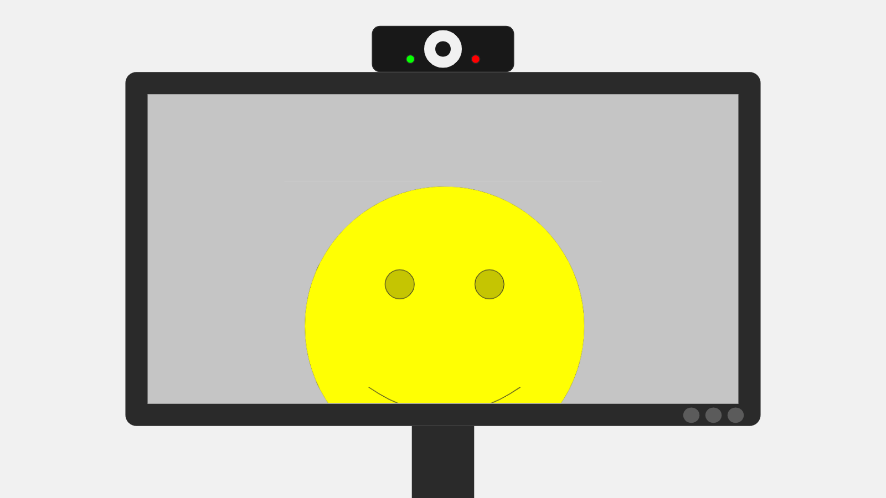

----

<iframe data-src=https://www.youtube.com/embed/gLlI5El7GyI width="100%" height="600px"></iframe>


----

## Setting

- 選擇攝影機（外接攝影機）
- 抬頭挺胸
- 調整攝影機的拍攝位置與角度
- 選擇容許持續姿勢不良的時間
- 保持抬頭挺胸大概三秒

----

<iframe data-src=https://www.youtube.com/embed/IMO72hAXNo8 width="100%" height="600px"></iframe>

---


## `Anit iHunch` 的程式碼


----

## `Anit iHunch` 安裝

```bash
git clone https://github.com/KuiMing/anti_iHunch.git
cd anti_iHunch
python3.7 setup.py install
```
----

## `Anit iHunch` 使用

- 執行 `Python` Code
```bash
python3.7 main.py --setting
python3.7 main.py --show
```

- 或者，可以直接進到 `dist` 資料夾，使用執行檔（Mac)


---


## 建議螢幕設置

- 螢幕與眼睛的距離：52 ~ 73 公分


<font size=2 color="#33C7FF" style="position: absolute; top: 635px; left: 50px">Rempel D, Willms K, Anshel J, Jaschinski W, Sheedy J. The effects of visual display distance on eye accommodation, head posture, and vision and neck symptoms. Hum Factors. 2007 Oct;49(5):830-8. doi: 10.1518/001872007X230208. PMID: 17915601. </font>

<font size=2 color="#33C7FF" style="position: absolute; top: 665px; left: 50px">Figure From: https://www.flaticon.com/</font>
----

## 建議螢幕設置

眼睛與螢幕中心點的連線和水平視線之間的夾角為 15 度

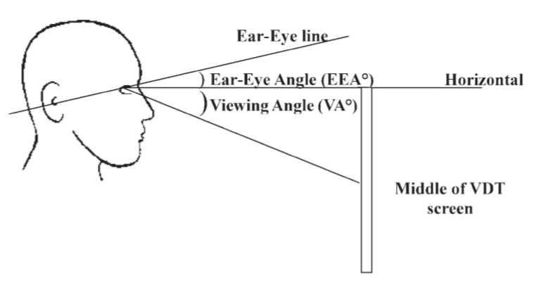

<font size=2 color="#33C7FF" style="position: absolute; top: 635px; left: 50px">Seghers J, Jochem A, Spaepen A. Posture, muscle activity and muscle fatigue in prolonged VDT work at different screen height settings. Ergonomics. 2003 Jun 10;46(7):714-30. doi: 10.1080/0014013031000090107. PMID: 12745683. </font>

<font size=2 color="#33C7FF" style="position: absolute; top: 665px; left: 50px">Burgess-Limerick R, Mon-Williams M, Coppard VL. Visual display height. Hum Factors. 2000 Spring;42(1):140-50. doi: 10.1518/001872000779656598. PMID: 10917150.</font>

---

## 小實驗

- 以半小時為單位，偵測並記錄頸前傾次數
- 實驗組：在偵測到頸前傾時，發出語音提醒
- 對照組：在偵測到頸前傾時，不發出語音提醒
- 受測者：我本人
- 資料筆數：實驗組 8 筆，對照組 9 筆

----

### 實驗結果

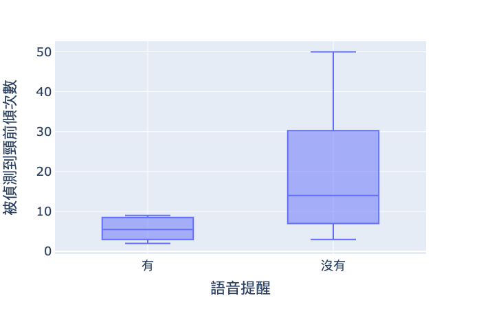


----


### 實驗結果

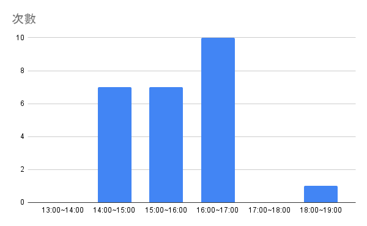


---

## 使用心得

- 視線很重要
- 可以考慮調高螢幕高度
- 看不清楚就應該放大字體
- 大概半小時就應該離開椅子活動


---

## 試著使用筆電（外接攝影機）

----

## 較好的坐姿

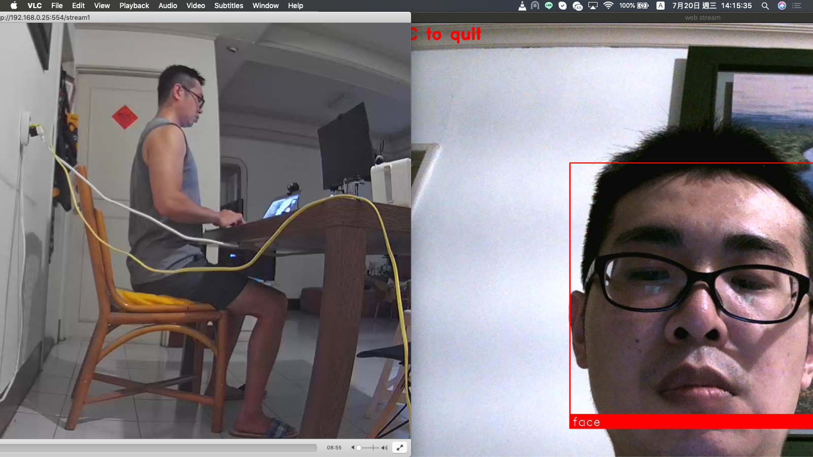

----

## 頸前傾

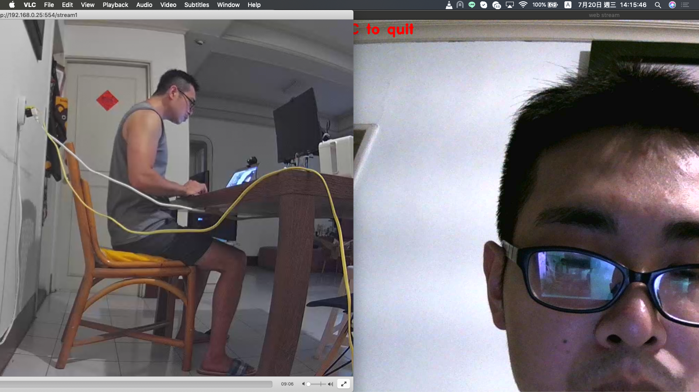

----

## 半躺半坐

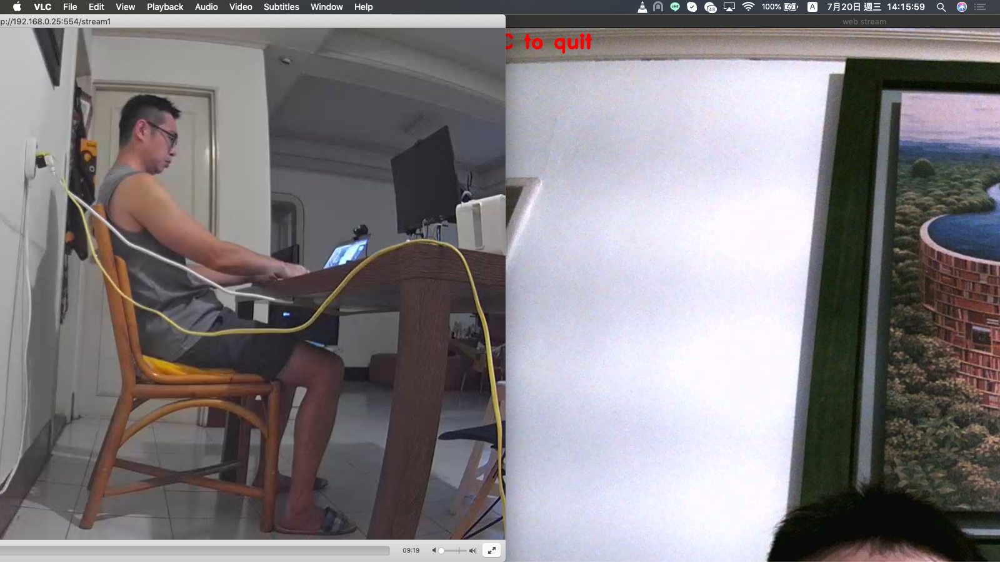

---

## Future Work

- 偵測戴口罩的臉
- Microcontroller Unit
  - Azure Face API
    - Free Instance: 
      - 20 transactions per minute
      - 30000 transactions free per month
  - 每分鐘偵測一次，每天可使用 16 小時

---

## 曾經的問題與建議
- 可以考慮使用 Time of Flight Sensor (VL53L0x)
  - 原理：透過 Laser 折返的時間計算與物體之間的距離
  - 效果比紅外線避障感測器穩定
  - 搭配 Microcontroller Unit ，體積可以變小很多
  - 需要另外想如何設置

----
MCU and TOF Sensor


----

簡單測試結果


----

## 曾經的問題與建議

- 請問 WebCam 規格？
  - 1080P, 30FPS, 價格：558 TWD
- 如果坐太久腰痛或想偷懶怎麼辦？
  - 真的不舒服，請去看醫生，有可能問題已經不是單純姿勢不良
  - 不應久坐，坐了半小時請起來活動
  - 這個方法只適合自己想要改善坐姿的人，想偷懶我也沒辦法
  

---

# 若有身體不適
# 請及早就醫

---

# Thank you!